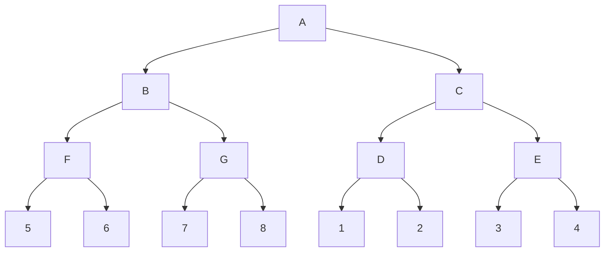

# Word2Vec学习笔记

## 1. 单词的表示方法

### 1.1 One-Hot Representation

将词库中所有单词用唯一一个**高维稀疏**的向量进行表示。向量的维度为词库的单词数（一般为$10^5$数量级），每个单词对应的向量中只有一个元素为$1$，其他元素均为$0$，而为$1$的元素的位置也表示着该单词在词库中的位置。比如，词库中只有五个单词：$\{a, am, boy, good, I\}$。此时这五个单词对应的One-Hot编码如下：

- a：$\left[1,0,0,0,0\right]$
- am：$\left[0,1,0,0,0\right]$
- boy：$\left[0,0,1,0,0\right]$
- good：$\left[0,0,0,1,0\right]$
- I：$\left[0,0,0,0,1\right]$

#### 1.1.1 One-Hot Representation的优势与局限

- **优势：** One-Hot编码大大降低了单词的==存储成本==，可以直接讲文本词库按照稀疏矩阵的格式进行存储，即根据单词在词库中的位置，给每一个单词分配唯一的索引(index)。
- **劣势：** One-Hot编码的缺陷在于，在计算过程中会面临==维数灾难==，这一点在大型词库中更明显；同时，One-Hot编码方式只能保留单词的位置信息，不能保留单词的==语义信息==，无法体现一些词汇之间的相似关系，这会加重下游机器学习模型的任务负担。

### 1.2 Distributed Representation

将词库中的词用低维向量（“低维”指相对于One-Hot Representation），这种低维向量显然不能表示单词在词库中的位置信息，但是可以通过特定的训练手段使其获得单词的语义信息。这种表示又称**Embedding**。

#### 1.2.1 Distributed Representation 的优势与局限

- **优势：**
    - 分布式表示可以==大幅降低单词编码向量的维度==（一般来讲合适的编码维度在$10^2$数量级）且受到词库大小的影响并不明显。
    - 分布式表示天生具备==保留单词语义信息==的条件。因此特别适合用于一些语义相关的下游任务。
- **劣势：**
    - 早期单词的分布式表示是神经网络语言模型的产物，这需要神经网络同时训练网络参数与单词的分布式编码向量，\textcolor{blue}{可能会导致较大的训练负担 。
- ==Word2Vec克服了上述困难，提出了一种**对数线性模型(New Log-Linear Models)**来单独训练单词的分布式表达。==

### 1.3 Embedding如何体现语义信息

Word2Vec的论文<a href="#efficient">1</a>指出：语义相似的单词的 Embedding 应该也是相似的。具体来讲，特定的单词的 Embedding 之间应该满足一个**十分简单的线性关系**。在此举如下 的一个例子：
$$
Vec_{king} - Vec_{man} + Vec_{woman} \approx Vec_{queen}
$$
进行移项后即为：
$$
Vec_{king} - Vec_{man} \approx Vec_{queen} - Vec_{woman}
$$
即国王 (king) 与男性 (man) 之间在语义上的不同应该与王后 (queen) 和女人 (woman) 在语义上的不同是相似的，这是符合我 们的语言逻辑的。而 Word2Vec 的目的就是通过简单的方法训练 出能满足上述单词语义信息的词向量。更多的例子见下图<a href="#distributed">2</a>:

## 2. 基于向量内积的Word2Vec

Word2Vec 的基本思想是：一个句子中距离相近的单词之间是有 关系的，因此我们可以通过相近的词语进行相互的预测。根据预 测方向的不同，Word2Vec 可以细分为两种模型：skip-gram 以及 CBOW。

- **Skip-Gram(Continuous Skip-gram Model):**  使用中心词预 测周围词
-  **CBOW(Continuous Bag-of-Words Model):**  使用周围词预 测中心词

无论是 Skip-Gram 还是 CBOW，不同单词之间的相关性都是通过单词对应的向量的内积来表示的，个人认为这种模型的背后有两方面数学直觉：

1. 单词之间的相关性关系应该满足对称性。例如，如果A单词的下一个单词是B，那么B单词的上一个单词是A，即A与B相关，则B与A也相关。而向量内积也满足对称性 关系。
2. 当所有向量都经过归一化处理后，向量的内积可以看作是他 们之间夹角的==余弦值==，这个值越大，说明两个向量越相似。

#### 2.1 Skip-Gram

##### 2.1.1 Skip-Gram 模型结构

Skip-Gram 通过 softmax 函数来将两个 词向量的内积转化为两个词共同出现的概率, 用中心词预测周围词，模型结构如下图<a href="#efficient">1</a>：

基于该结构定义的概率模型为：
$$
P(w_{O}|w_I) = \frac{\exp(v'^T_{w_O}v_{w_I})}{\sum^W_{w=1}\exp(v'^T_{w}v_{w_I})}
$$
其中$w_O$表示周围词的词向量(output)，$w_I$表示中心词的词向量(input)。本质上，Skip-Gram要做的是用一个句子中的中心词，预测出改中心词的若干个周围词，即为一个多分类模型，分类数量为词库的单词数，因此模型选择了softmax函数来将向量的内积映射成词对共现的概率。

##### 2.1.2 Skip-Gram优化目标

在给定的语料下，Skip-Gram的优化目标为最大化语料库里面合适的词对的共现对数概率 (log probability)，即最大化下式：
$$
\frac{1}{T}\sum^{T}_{t=1}\sum_{-c\leq j\leq c, j\neq 0}\log p(w_{t+j}|w_t)
$$

#### 2.2 CBOW

##### 2.2.1 CBOW模型结构

CBOW 也是通过 softmax 函数来将两 个词向量的内积转化为两个词共同出现的概率, 与Skip-Gram不同的是，其用周围词预测中心词，同时在做向量内积之前，先将周围词的词向量进行求和。模型结构如下图<a href="#efficient">1</a>，其概率模 型公式不在赘述。

##### 2.2.2 CBOW优化目标

在给定的语料下，CBOW的优化目标也是最大化语料库里面合适的词对的共现对数概率 (log probability)，即下式：
$$
 \frac{1}{T}\sum^{T}_{t=1}\sum_{J=\{j||j-t|\leq c\}}\log p(w_{t}|w_J)
$$

## 3. Word2Vec的优化算法

### 3.1 Hierarchical Softmax

层次Softmax的初步逻辑在于：通过二叉树将Softmax计算转化为Sigmoid计算。借此将Softmax 需要的$|W|$个指数运算降 低到 Hierarchical Softmax 的$log_2 |W|$个指数运算。进一步，可以采用==Huffman==树（带权重路径最短二叉树），可以将指数计算的次数进一步降低到$log_2 |W|$以下，数学表示见下式：
$$
p(w|w_I) = \prod^{L(w)-1}_{j=1}\sigma\big([n(w,j+1)=ch(n(w,j))]\cdot v'^T_{n(w,j)} v_{w_I}\big)
$$
其中：

- $L(W)$:  树的高度

- $n(w,j)$:  词$w$对应路径上的第$j$个节点

- $ch(n(w,j))$:  $n(w,j)$的右节点

- $[x]$:
    $$
    [x]=\left\{\begin{aligned}
            1, \quad \text{if x is true}\\
            -1, \quad \text{if x is false}
            \end{aligned}\right.
    $$

树的示意图如下:

从上图不难看出，面对8个单词的词库，传统的softmax函数需要8次指数运算，但是分层softmax只需要$\log_2 8=3$次指数运算。

### 3.2  Negative Sampling

除了分层 Softmax 外，文献<a href="#distributed">2</a>还提供了一种更简洁的优化目标 函数，该函数通过负采样方法生成并将多分类问题转化为二分类 问题，其数学表达式如下：
$$
\log\sigma(v'^T_{w_O} v_{w_I})+\sum^k_{i=1}\mathbb{E}_{w_i \sim P_n(w)}[\log\sigma(-v'^T_{w_i} v_{w_I})]
$$
其中：

- $v'_{w_O}$：周围词向量
- $v_{w_I}$：中心词向量
- $v'_{w_i}$：负样本词向量

==负采样效果以及计算速度在一般情况下都优于层次 Softmax，因 此后续工作中前者的使用更普遍。==

##### 3.2.1 Negative Sampling 中的$\mathbb{E}_{w_i \sim P_n(w)}$

负采样过程中，对负样本的采样并不是依据单词原本的分布规律，而是在此基础上进行了微调，每个词向量被选中的概率如下：
$$
P(w)=\frac{U(w)^{\frac{3}{4}}}{Z}
$$
其中$Z$为归一化参数，==目的是使变换后概率和仍然为一==。其计算方法如下：
$$
 Z = \sum^W_{i=1}P(w_i)^{\frac{3}{4}}
$$
对采样所依据的概率分布的调整的目的是为了==减小频率大的词的抽样概率==，==增加频率小的词的抽样概率==，可以视作一种**平滑处理**。

### 3.3 Subsampling of Frequent Words

Subsampling的出发点有如下两点：

1. 词库中出现频率高的单词往往携带较少的==语义信息==，而出现 频率低的单词往往携带较多的语义信息。
2. 词库中出现频率高的单词往往==很快就能完成训练==，而出现频 率低的单词则需要多轮次的训练。

基于上述考虑，重采样给出如下公式来定义采样后删除样本的概率<a href="#distributed">2</a>：
$$
P(w_i) = \max(0,1-\sqrt{\frac{t}{f(w_i)}})
$$
可以看出，频率越高的单词，采样后被删除的概率越大，且当单 词频率小于t时，不可能被删除(==注：原论文中没有$\max$操作，但是考虑到概率应该大于等于零，故添加之==)。

## 4. 结语

### 4.1 Word2Vec效果总结

- 如上图 <a href="#efficient">1</a>所示，Word2Vec 生成的词向量无论是在==语法相关性==还是==语义相关性==上都有出色的表现。

- Word2Vec 生成的词向量因此也==用于许多下游语义相关的自 然语言处理任务==，并且取得了较好的性能<a href="#efficient">1</a>。

### 4.2 Word2Vec模型总结

- 通过向量的内积来反映词汇之间的相关性，整个模型只需要进行一次线性运算和一次对数运算，简化了embedding的算力负担。
- 同时提出了两种方向的词嵌入方法，即用中心词预测周围词的Skip-Gram以及用周围词预测中心词的CBOW。
-  分层softmax与负采样均可以代替传统的交叉熵，降低模型的优化难度。
- Subsampling可以进一步提高训练的效率。
-  ==Word2Vec 通过向量内积反应不同元素之间相关性的思路启发了后面图表征学习领域里的各种节点嵌入 (Node Embedding) 方法，如：Deepwalk, Node2Vec, LINE。==

## 参考文献

[1] Mikolov, Tomas, et al. "Efficient estimation of word representations in vector space." *arXiv preprint arXiv:1301.3781* (2013).

[2] Mikolov, Tomas, et al. "Distributed representations of words and phrases and their compositionality." *Advances in neural information processing systems* 26 (2013).

